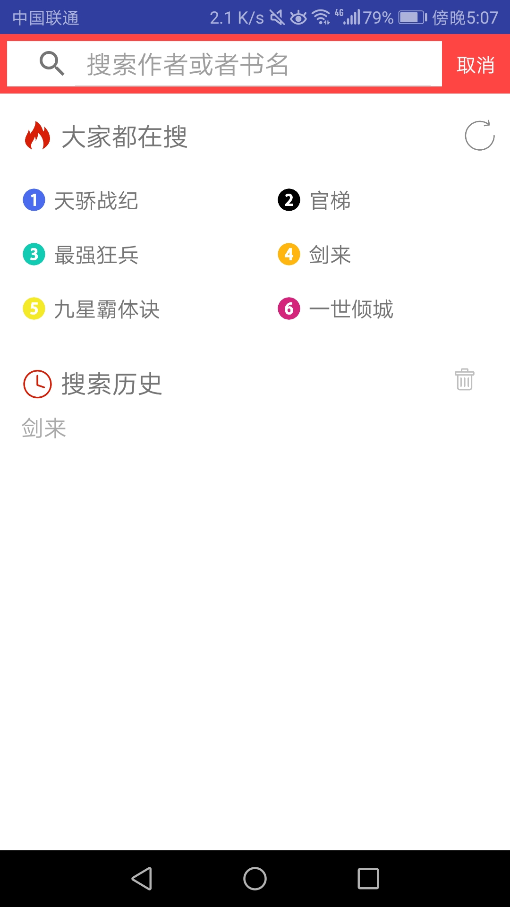
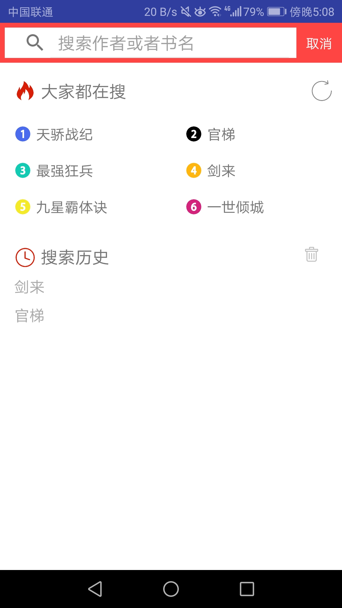
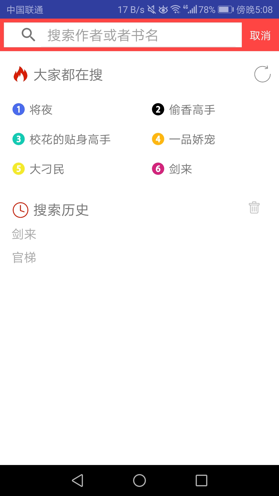

# 中山大学数据科学与计算机学院本科生实验报告
## （2018年秋季学期）
| 课程名称 | 手机平台应用开发 |   任课老师   |      郑贵锋       |
| :------: | :--------------: | :----------: | :---------------: |
|   年级   |       16级       | 专业（方向） |       嵌软        |
|   学号   |     16340014     |     姓名     |      车鑫恺       |
|   电话   |   18561830258    |    Email     | 1285224626@qq.com |
| 开始日期 |    2018.12.20    |   完成日期   |     2019.1.19     |

---

## 一、实验题目

 **Android小说阅读器FTEReader**

---

## 二、个人实现内容

- 数据库的创建和使用
- 搜索界面UI
- 热门书籍推荐
- 模糊搜索
- 搜索内容的点击
- 历史记录存储和点击
- api和素材的准备

---

## 三、实验结果
### (1)实验截图

#### 搜索界面UI初始状态



#### 搜索之后的状态


#### 模糊搜索推荐书籍


#### 历史记录的添加



#### 刷新热门书籍



### (2)实验步骤以及关键代码

#### 1.数据库创建

```java

@Override//创建数据库
public void onCreate(SQLiteDatabase sqLiteDatabase) {
    //书架上的书，含书名、类型（本地还是网络）、阅读进度、资源地址、书的封面
    String CREATE_TABLE1 = "CREATE TABLE if not exists "
            + TABLE_NAME1
            + " (_id TEXT PRIMARY KEY, name TEXT, type INTEGER ,progress INTEGER, address TEXT,image BLOB, description TEXT, author TEXT, major TEXT)";
    //搜索历史
    String CREATE_TABLE2 = "CREATE TABLE if not exists "
            + TABLE_NAME2
            + " (_id INTEGER PRIMARY KEY, content TEXT)";
    // 阅读器状态保存
    String CREATE_TABLE3 = "CREATE TABLE if not exists "
            + TABLE_NAME3
            + " (user_id INTEGER PRIMARY KEY, hor_or_ver_screen INTEGER, day_or_night_status INTEGER, textSize INTEGER)";
    sqLiteDatabase.execSQL(CREATE_TABLE1);
    sqLiteDatabase.execSQL(CREATE_TABLE2);
    sqLiteDatabase.execSQL(CREATE_TABLE3);

    Resources res = MainActivity.getContext().getResources();
    Bitmap bitmap = BitmapFactory.decodeResource(res, R.mipmap.bookcover);
    ContentValues values = new ContentValues();
    ShelfBookObj book = new ShelfBookObj("5816b415b06d1d32157790b1","圣墟",bitmap,"",0,"default",0,"在破败中崛起，在寂灭中复苏。沧海成尘，雷电枯竭，那一缕幽雾又一次临近大地，世间的枷锁被打开了，一个全新的世界就此揭开神秘的一角……","辰东","玄幻");
    //开始添加第一条数据_id TEXT PRIMARY KEY, name TEXT, type INTEGER ,progress INTEGER, address TEXT,image BLOB, description TEXT
    values.put("name",book.getName());
    //...
    sqLiteDatabase.insert(TABLE_NAME1,null,values);
    values.clear();
    bitmap = BitmapFactory.decodeResource(res, R.mipmap.bookcover2);
    book = new ShelfBookObj("59ba0dbb017336e411085a4e","元尊",bitmap,"",0,"default",0,"《斗破苍穹》《武动乾坤》之后全新力作，朝堂太子踏上了荆棘重生之路…","天蚕土豆","玄幻");
    values.put("name",book.getName());
    //...
    sqLiteDatabase.insert(TABLE_NAME1,null,values);

    // 往阅读器状态表格中保存一条初始阅读器状态
    UserStatusObj u = new UserStatusObj(0,1,0,18);
    values.clear();
    values.put("user_id", 0);           // 用户id为0，表示默认状态
    values.put("hor_or_ver_screen", u.getHor_or_ver_screen()); // 1表示竖屏，0表示横屏
    values.put("day_or_night_status", u.getDay_or_night_status()); // 0表示日间，1表示夜间
    values.put("textSize", u.getTextSize()); // 字体大小
    sqLiteDatabase.insert(TABLE_NAME3,null,values);
}
```

#### 2.书籍类封装

```java
public class ShelfBookObj {
    String bookId;                  //id
    private Bitmap icon;            //图标
    private String iconURL;         //图标网络url
    private String name;            //书名
    private String description;     //描述
    private String author;          //作者
    private String major;           //一级分类
    int type;                       //0代表网络图片，1代表本地图片
    private String address;         //本地书籍url
    private int readChapter;        //阅读到的章节
}//get、set函数太长省略
```

#### 3.视图填充

```java
TextView name = holder.getView(R.id.item_book_name);
    name.setText(book.getTitle());
    TextView author = holder.getView(R.id.item_book_author);
    author.setText(book.getAuthor());
    TextView major = holder.getView(R.id.item_book_type);
    major.setText(book.getCat());
    TextView intro = holder.getView(R.id.item_book_intro);
    String introString = book.getShortIntro();
    if (introString.length() > 50){
        introString = introString.substring(0,49)+"……";
    }
    intro.setText(introString);
    final ImageView cover = holder.getView(R.id.item_book_cover);
    new Thread(new Runnable() {
        @Override
        public void run() {
            try {
                if (isNetWorkConnected(MainActivity.getContext())) {//联网判断
                    URL url = new URL(BookService.StaticsUrl + book.getCover());
                    HttpURLConnection connection = (HttpURLConnection) url.openConnection();
                    connection.setRequestMethod("GET");
                    connection.setConnectTimeout(10000);
                    if (connection.getResponseCode() == 200) {
                        InputStream inputStream = connection.getInputStream();
                        final Bitmap bitmap = BitmapFactory.decodeStream(inputStream);
                        handler.post(new Runnable() {
                            @Override
                            public void run() {
                                cover.setImageBitmap(bitmap);
                            }
                        });
                    }
                }
                else{
                    Looper.prepare();
                    Toast.makeText(SearchActivity.this,"网络似乎出现了点问题",Toast.LENGTH_SHORT).show();
                    Looper.loop();
                }
            } catch (Exception e) {
                System.err.println(e.getMessage());
            }
        }
    }).start();
}
```

#### 4.item点击事件（历史记录item、搜索结果item、模糊推荐item）

```java
//搜索结果点击函数
public void onClick(final int position) {
    final Intent intent = new Intent(SearchActivity.this, BookDetailActivity.class);
    final Bundle bundle = new Bundle();
    new Thread(new Runnable() {
        @Override
        public void run() {
            if (isNetWorkConnected(MainActivity.getContext())) {
                final BookObj t = getBookService().getBookById(results.get(position).get_id());
                if (t != null)
                    handler.post(new Runnable() {
                        @Override
                        public void run() {
                            bundle.putSerializable("bookobj", t);
                            intent.putExtras(bundle);
                            startActivity(intent);
                        }
                    });
            }
            else {
                Looper.prepare();
                Toast.makeText(SearchActivity.this,"网络似乎出现了点问题",Toast.LENGTH_SHORT).show();
                Looper.loop();
            }
        }
    }).start();
}
```

#### 5.历史记录点击

```java
public void recordClick(final String s) {
    isSubmit = true;
    //设置可见
    initialLayout.setVisibility(View.GONE);
    searchLayout.setVisibility(View.VISIBLE);
    fuzzyList.setVisibility(View.GONE);
    resultList.setVisibility(View.VISIBLE);
    //添加历史
    if (!histories.contains(s)){
        histories.add(s);
        getInstance(getBaseContext()).addSearchHistory(s);
    }
    //填充数据
    new Thread(new Runnable() {
        @Override
        public void run() {
            if (isNetWorkConnected(MainActivity.getContext())) {
                SearchResultObj tt = getBookService().getSearchResultObj(s, 0, 8);
                results.clear();
                if (tt != null) {//api是否出现问题判断
                    List<SearchResultObj.book> t = tt.getBookList();
                    results.addAll(t);
                    handler.post(new Runnable() {
                        @Override
                        public void run() {
                            recyclerViewAdapter.notifyDataSetChanged();
                        }
                    });
                }
                else {
                    Looper.prepare();
                    Toast.makeText(SearchActivity.this,"搜索不到相关内容",Toast.LENGTH_SHORT).show();
                    Looper.loop();
                }
            }
            else {
                Looper.prepare();
                Toast.makeText(SearchActivity.this,"网络似乎出现了点问题",Toast.LENGTH_SHORT).show();
                Looper.loop();
            }
        }
    }).start();
    recyclerViewAdapter.notifyDataSetChanged();
    searchView.setQuery(s,true);
}
```

#### 6.搜索事件

```java
@Override
public boolean onQueryTextChange(final String s) {
    //设置可见
    if (!isSubmit) {
        if (s.equals("")) {
            initialLayout.setVisibility(View.VISIBLE);
            searchLayout.setVisibility(View.GONE);
        }
        else {
            initialLayout.setVisibility(View.GONE);
            searchLayout.setVisibility(View.VISIBLE);
            fuzzyList.setVisibility(View.VISIBLE);
            resultList.setVisibility(View.GONE);
        }
    }
    else {
        if (s.equals("")) {
            fuzzyList.setVisibility(View.GONE);
            resultList.setVisibility(View.VISIBLE);
        }
        else {
            fuzzyList.setVisibility(View.VISIBLE);
            resultList.setVisibility(View.GONE);
        }
    }
    //填充数据
    if (!s.equals("")&&flag) {
        new Thread(new Runnable() {
            @Override
            public void run() {
                flag = false;
                if (isNetWorkConnected(MainActivity.getContext())) {
                    SearchResultObj tt = getBookService().getSearchResultObj(s, 0, 8);
                    List<String> t = new ArrayList<>();
                    if (tt != null) {
                        List<SearchResultObj.book> tss = tt.getBookList();
                        int size = tss.size();
                        for (int i = 0; i < size; i++)
                            t.add(tss.get(i).getTitle());
                    }
                    tempFuzzy.clear();
                    if (t.size() > 0)
                        tempFuzzy.addAll(t);
                    handler.post(new Runnable() {
                        @Override
                        public void run() {
                            fuzzyAdapter.notifyDataSetChanged();
                        }
                    });
                }
                else {
                    Looper.prepare();
                    Toast.makeText(SearchActivity.this,"网络似乎出现了点问题",Toast.LENGTH_SHORT).show();
                    Looper.loop();
                }
                flag = true;
            }
        }).start();
        fuzzyAdapter.notifyDataSetChanged();
    }
    return false;
}
```

#### 7.数据库的增删改查（各列一例、函数过多不一一详述）

```java
//更新阅读进度
public void updateProgress(int progress, String id) {
    SQLiteDatabase db = getWritableDatabase();
    ContentValues value = new ContentValues();
    value.put("progress", progress);
    db.update(TABLE_NAME1, value, "_id=?", new String[] { id });
    db.close();
}
```

### (3)实验遇到的困难以及解决思路

1. 书籍的简介过长导致搜索结果列表布局变形，后来设置当简介超过50字时后面的内容以“......”代替，这样布局就正常了。
2. 搜索输入速度太快会导致闪退，原因是新开线程，同步问题，有的线程内清空List，而有的线程正在调用List里的元素，导致出问题，加上同步变量即可，属于操作系统中简单的生产者消费者问题。
3. 数据库类改变类的架构之后没有在数据库的表中加入对应的属性，导致从数据库导入数据到list的时候出了问题，加上新增的属性即可。
4. 用ConstraintLayout作为recylerView的布局格式底下会被导航栏遮挡，改成LinearLayout之后就正常显示了。
5. 网络断开之后会发生闪退，因为api获取不到东西了，需要加上联网判断，先确定有网络连接在通过api获取数据。
6. api崩溃，中间出现过一次api失效，加入api崩溃检测，如果崩溃，弹Toast提示，就不会发生因api失效的莫名闪退，起码知道问题出在哪儿。


---

## 四、实验思考及感想

---

1. 资源还是一个比较需要花时间处理的问题，不过这次的项目相比于期中项目来说还是美观了很多、我们在网上找到了一个图标的网站、很多小图标找起来就比较方便，不过还是有一些书本图片需要做背景透明化、截取等处理。另外api的寻找也比较麻烦，因为没有自己搭建后台的话想开发需要的app找起来就有很多限制，在github找了几个api组合起来用达成了项目的需求。
2. 数据库一开始搭建好之后随着开发的需求对属性历经了三次大的变动、增加了很多函数、删改了很多属性，像是图片由BLOB变为URL（TEXT）来存储等等，很多问题都是在不断开发的过程中才显露出来的。
3. 协作复用这次做的还不错，相比较于期中项目很多代码重复，最后在修改，这次我们在一开始就分好Packet，分好servive、obj、control各个包，每份代码都不可缺失、都有独到的作用。
4. 异常情况处理，对于没有网路、api失效的情况做了考虑，不会出现闪退等情况，这一点是很重要的，如果因为没有网路的问题突然闪退会对app的使用体验造成极大的影响，所以加了对应的异常检测和处理。
5. UI问题，基础界面写出来很简陋，历史记录功能、热门图书功能都没有，一步步精益求精，功能逐渐完善，界面更加舒服，其实这些都是细节，可能使用者不会特别注意。像是排行的数字图标，字之间的间隔，背景颜色，一个完整的app大概就是这样成长起来的吧。和平时作业完全不同的感觉，感觉一切都是为了使用者服务吧。

## 五、个人贡献

1. 整个搜索界面的UI
2. 整个搜索界面的函数交互
3. 绝大多数的数据库的建立、调用的接口函数
4. api服务的部分函数
5. api、图片等资源的查找
6. 小组报告、接口文档

