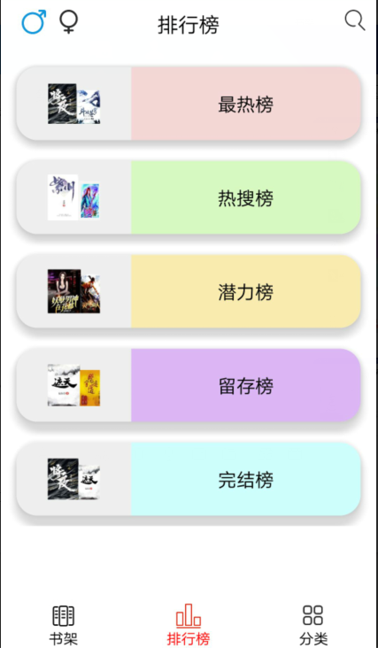
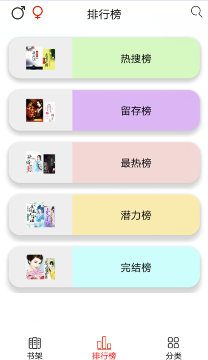
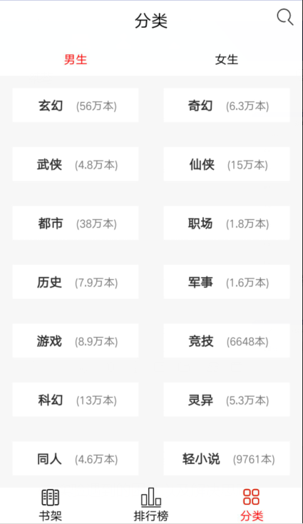
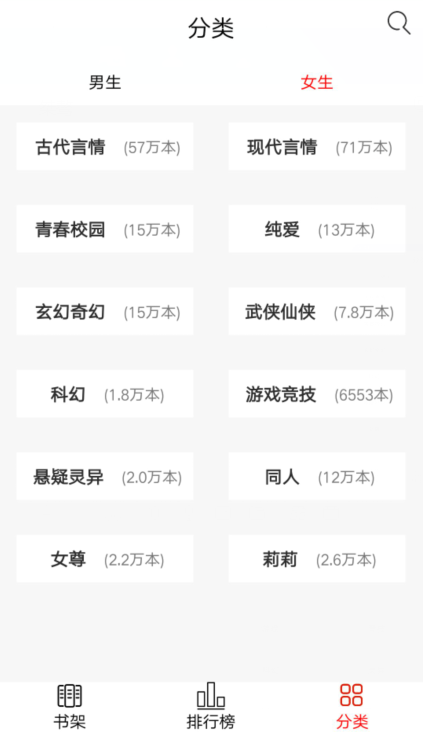

# 中山大学数据科学与计算机学院本科生实验报告
## （2018年秋季学期）
| 课程名称 | 手机平台应用开发 |   任课老师   |      郑贵锋       |
| :------: | :--------------: | :----------: | :---------------: |
|   年级   |       16级       | 专业（方向） |       计应        |
|   学号   |     16340017     |     姓名     |       陈帆        |
|   电话   |   18229705627    |    Email     | 1163874966@qq.com |
| 开始日期 |    2018.12.20    |   完成日期   |     2019.1.19     |

---

## 一、实验题目

 **Android小说阅读器FTEReader**

---

## 二、个人实现内容

1. 书架、排行榜、分类界面的总体布局
2. 排行榜界面UI及逻辑具体设计
3. 分类界面UI及逻辑具体设计

---

## 三、实验结果
### (1)实验截图

#### 书架


#### 排行榜



#### 具体排行榜


#### 分类



#### 具体分类


#### 上拉加载和下拉刷新


### (2)实验步骤以及关键代码

#### 总体界面布局的设计

在参考了很多小说阅读器后，我们决定把主界面设计成类似微信的样式，设计3个界面：书架、排行榜、分类。利用底部导航栏来切换界面，当然也可以直接滑动切换，可以从这3个界面跳转到其他界面，如搜索界面、阅读界面。

要实现这样的效果，ViewPager+Fragment的使用是必不可少的，我结合使用了这两个控件及RadioGroup来实现总体界面。

主界面具有顶部提示栏和底部导航栏，中间就是显示具体界面的帧，在滑动时可以看到它们的差别。

要通过RadioGroup来实现底部导航栏的效果，我们可以利用RadioButton的`android:button="@null"`这个属性来把圆形按钮去掉，然后利用`android:drawableTop="@mipmap/bookshelf"`属性来给RadioButton显示不同的图片，在RadioButton被选中时，还需要设置字体的颜色以及改变图片颜色，以达到被选中的效果。RadioButton的选中与ViewPager切换帧需要结合起来，才能达到导航栏的效果。

```java
//处理底部RG事件
bottomRG.setOnCheckedChangeListener(new RadioGroup.OnCheckedChangeListener() {
    @Override
    public void onCheckedChanged(RadioGroup group, int checkedId) {
        int index = 0;
        switch (checkedId) {
            case R.id.main_bottom_bookshelf:
                index = 0;
                //设置图片
                break;
            case R.id.main_bottom_ranking:
                index = 1;
                //设置图片
                break;
            case R.id.main_bottom_category:
                index = 2;
                //设置图片
                break;
        }
        viewPager.setCurrentItem(index);
    }
});
```


```java
//设置一个ViewPager的监听事件，左右滑动ViewPager时进行处理
public class MyPagerChangeListener implements ViewPager.OnPageChangeListener {
    @Override
    public void onPageScrollStateChanged(int arg0) {
    }
    @Override
    public void onPageScrolled(int arg0, float arg1, int arg2) {
    }
    @Override
    public void onPageSelected(int arg0) {
        switch (arg0) {
            case 0:
                title.setText("书架");
                radioGroup.setVisibility(View.GONE);
                bookshelfRB.setChecked(true);
                break;
            case 1:
                title.setText("排行榜");
                radioGroup.setVisibility(View.VISIBLE);
                rankingRB.setChecked(true);
                break;
            case 2:
                title.setText("分类");
                radioGroup.setVisibility(View.GONE);
                categoryRB.setChecked(true);
                break;
        }
    }
}
```


#### 排行榜界面的设计

排行榜界面分男女，主界面上显示的是榜单，点击榜单可以进入到相应的具体排行榜。榜单的UI设计利用了CardView和RecyclerView，男生榜单和女生榜单写在同一个Fragment中。具体的排行榜界面分为标题栏、顶部导航栏和具体排行榜，每一个排行榜都写在一个Fragment中，利用传递的不同参数来填充不同的数据。

具体的排行榜是一个Activity，而不同的榜单(周榜、月榜、总榜)则是不同的Fragment，进入具体的排行榜时生成对应的榜单并传递参数：

```java
//排行榜的Fragment
for (int i = 0; i < 3; ++i) {
    DetailCategoryFragment fragment = new DetailCategoryFragment();
    Bundle bundle1 = new Bundle();
    bundle1.putString("title", bundle.getString("title"));
    bundle1.putBoolean("isRanking", isRanking);
    bundle1.putBoolean("isMale", isMale);
    if (i == 0) bundle1.putString("type", "周榜");
    else if (i == 1) bundle1.putString("type", "月榜");
    else bundle1.putString("type", "总榜");
    fragment.setArguments(bundle1);
    fragmentList.add(fragment);
}
```

导航栏的效果与主界面相同，不做赘述。

在生成不同的榜单时，则需要根据获取的参数来访问API，填充数据。

获取排行榜书单分为两步：

1. 获取全部的排行榜，根据所需要的榜单来获取到具体榜单的id
2. 根据具体榜单的id访问API，获取书籍信息并处理

**所有的网络访问都需要使用线程去完成**

具体的实现逻辑如下：

1. 首先检查网络连接是否正常

   ```java
   //检查网络连接
   ConnectivityManager connect = (ConnectivityManager)getActivity().getSystemService(Context.CONNECTIVITY_SERVICE);
   NetworkInfo info = connect.getActiveNetworkInfo();
   if (info == null || !info.isAvailable()) {
       Toast.makeText(getActivity(), "网络连接状况：未连接", Toast.LENGTH_LONG).show();
       return;
   }
   ```

2. 使用线程访问网络，获取全部排行榜

   ```java
   AllRankingObj allRankingObj = bookService.getAllRankingObj();
   if (allRankingObj == null || allRankingObj.isOk() == false) {
       Looper.prepare();
       Toast.makeText(getContext(), "获取数据失败", Toast.LENGTH_LONG).show();
       Looper.loop();
       Log.d("error", "获取全部排行榜失败");
       return;
   }
   ```

3. 获取具体榜单的id

   ```java
   //获取具体榜单的id
   if (isMale) {   //男生
       for (AllRankingObj.subClass subClass : allRankingObj.getMaleList()) {
           if (subClass.getShortTitle().equals(title)) {
               if (title.equals("热搜榜")) rankingid = subClass.getId();
               else {
                   if (type.equals("周榜")) rankingid = subClass.getId();
                   else if (type.equals("月榜")) rankingid = subClass.getMonthRank();
                   else if (type.equals("总榜")) rankingid = subClass.getTotalRank();
                   else {
                       System.exit(1);
                       Log.d("error", "榜单名错误！");
                   }
               }
               break;
           }
       }
   }
   else {          //女生
       //省略
   }
   ```

4. 在线程中新开一个线程，再次访问网络，获取书籍

   ```java
   //得到id后再获取具体榜单的书籍信息
   new Thread(new Runnable() {
       @Override
       public void run() {
           SingleRankingObj singleRankingObj = bookService.getSingleRankingObj(rankingid);
           if (singleRankingObj == null || singleRankingObj.isOk() == false) {
               Looper.prepare();
               Toast.makeText(getContext(), "获取失败", Toast.LENGTH_LONG).show();
               Looper.loop();
               Log.d("error", "获取单一排行榜失败");
               return;
           }
           List<BookObj> objList = singleRankingObj.getRanking().getBookList();
           total = singleRankingObj.getRanking().getTotal();
           for (int i = 0; i < objList.size(); ++i) {
               BookObj bookObj = objList.get(i);
               String intro = bookObj.getShortIntro();
               if (intro.length() > 50) intro = intro.substring(0, 50);
               intro += "...";
               bookObj.setShortIntro(intro);
               bookObjList.add(bookObj);
           }
           //使用handler
       }
   }).start();
   ```

5. 获取到书籍后需要填充RecyclerView的Adapter并显示，UI的修改无法在子线程中完成，因此需要使用Handler

   ```java
   handler.post(new Runnable() {
       @Override
       public void run() {
           updateRecyclerView(0, PAGE_COUNT);
           progressBar.setVisibility(View.GONE);
           //数据加载完毕时取消动画
           swipeRefreshLayout.setRefreshing(false);
           Toast.makeText(getActivity(), "数据刷新完成", Toast.LENGTH_SHORT).show();
       }
   });
   ```


获取到了数据之后，我们还需要把数据显示出来。

首先注意到榜单前3名有金、银、铜牌的标识，这简单地设置visible即可。

书籍条目的其他信息都是简单的填充，没有太多技术性问题。但图片的显示也需要网络访问，并且需要使用线程来异步访问，否则就会太过耗时。

```java
//通过网络获取书籍图标
final String iconURL = BookService.StaticsUrl +  bookObj.getCover();
new Thread(new Runnable() {
    @Override
    public void run() {
        try {
            URL url = new URL(iconURL);
            HttpURLConnection connection = (HttpURLConnection) url.openConnection();
            connection.setRequestMethod("GET");
            connection.setConnectTimeout(10000);
            if (connection.getResponseCode() == 200) {
                InputStream inputStream = connection.getInputStream();
                final Bitmap bitmap = BitmapFactory.decodeStream(inputStream);
                mHandler.post(new Runnable() {
                    @Override
                    public void run() {
                        imageView.setImageBitmap(bitmap);
                    }
                });
            }
        } catch (Exception e) {
            System.err.println(e.getMessage());
        }
    }}).start();
```


#### 分类界面的设计

分类界面也分男生女生，并写在不同的Fragment里，这一点与排行榜界面不同。利用RecyclerView和Button来显示不同的分类。

具体分类界面的设计与具体排行榜界面很相似，因此我把它们的实现写在了同一个Activity中，实现了重用。

主要的不同之处还是体现在获取数据的方式上，获取具体分类的书籍并没有排行榜那么麻烦，根据具体类型即可访问API来获取：

```java
//获取具体分类书单
void getCateBookList() {
    new Thread(new Runnable() {
        @Override
        public void run() {
            String gender = (isMale == true) ? "male" : "female";
            Log.d("type:", "" + type);
            final CategoryObj categoryObj = bookService.getBooksByCategoty(type, title, 0, 30000, gender);
            if (categoryObj == null || categoryObj.isOk() == false) {
                Looper.prepare();
                Toast.makeText(getContext(), "获取数据失败", Toast.LENGTH_LONG).show();
                Looper.loop();
                Log.d("error", "获取主题书单列表失败");
                return;
            }
            total = categoryObj.getTotal();
            for (BookObj bookObj : categoryObj.getBooks()) {
                if (bookObj.getShortIntro().length() > 50){
                    String intro = bookObj.getShortIntro();
                    intro = intro.substring(0, 50);
                    intro += "...";
                    bookObj.setShortIntro(intro);
                }
                bookObjList.add(bookObj);
            }
            //handler
        }
    }).start();
```


#### 数据下拉刷新和上拉加载的实现

事实上，因为网络中的书籍太多，我们不可能一次性把API提供的所有书籍都获取出来，这样不仅耗时，而且浪费用户流量，因此分批次加载是必须的。鉴于此，我给排行榜和分类界面的书籍获取设计了下拉刷新和上拉加载。

下拉刷新比较简单，可以利用SwipeRefreshLayout来实现。

在布局中使用一个SwipeRefreshLayout包裹RecyclerView：

```xml
<android.support.v4.widget.SwipeRefreshLayout
                                              android:id="@+id/detail_category_swipeRefresh"
                                              android:layout_height="match_parent"
                                              android:layout_width="match_parent">
    <android.support.v7.widget.RecyclerView
                                            android:id="@+id/detail_category_recyclerView"
                                            android:layout_width="match_parent"
                                            android:layout_height="wrap_content"
                                            android:overScrollMode="never"/>
</android.support.v4.widget.SwipeRefreshLayout>
```

SwipeRefreshLayout自带了下拉操作，因此我们只需要设置下拉刷新的回调事件即可：

```java
//设置下拉显示的动画颜色
swipeRefreshLayout.setColorSchemeColors(Color.RED, Color.BLUE);
//下拉刷新的回调事件
swipeRefreshLayout.setOnRefreshListener(new SwipeRefreshLayout.OnRefreshListener() {
    @Override
    public void onRefresh() {
        //数据刷新
        initBookList();
    }
});
```

initBookList函数重新加载书籍，实现刷新效果。

上拉加载的实现思路则是给RecyclerView增加一个显示的条目类型，即底部提示的View，平时这个View都是隐藏的，在上拉到底部时就会显示出来，并根据加载进度显示“正在加载更多”或者“没有更多数据了”。

为了实现上拉加载，我重新自定义了一个RecyclerView的Adapter，一些重要的变量及函数如下：

```java
private int normalType = 0;     // 第一种ViewType，正常的item
private int footType = 1;       // 第二种ViewType，底部的提示View

private boolean hasMore = true;   // 变量，是否有更多数据
private boolean fadeTips = false; // 变量，是否隐藏了底部的提示

private Handler mHandler = new Handler(Looper.getMainLooper()); //获取主线程的Handler

public MyViewHolder onCreateViewHolder(@NonNull ViewGroup viewGroup, int viewType) {
    //根据不同的ViewType绑定不同的布局文件
    if (viewType == normalType) {
        MyViewHolder holder = MyViewHolder.get(context, viewGroup, R.layout.item_book);
        holder.setNormalTypeType(true);
        return holder;
    }
    else {
        MyViewHolder holder = MyViewHolder.get(context, viewGroup, R.layout.recycler_footer_view);
        holder.setNormalTypeType(false);
        return holder;
    }
}
```

```java

public void onBindViewHolder(@NonNull final MyViewHolder holder, int position) {
    if (data.isEmpty()) return;
    if (holder.isNormalType() == true) {//是正常的布局
        //显示书籍条目信息
    }
    else {//是提示加载信息的布局
        final ProgressBar progressBar = holder.getView(R.id.footer_view_progessBar);
        final TextView tips = holder.getView(R.id.footer_view_text);
        tips.setVisibility(View.VISIBLE);
        progressBar.setVisibility(View.VISIBLE);
        // 只有获取数据为空时，hasMore为false，所以当我们拉到底部时基本都会首先显示“正在加载更多...”
        if (hasMore == true) {
            // 不隐藏footView提示
            fadeTips = false;
            if (data.size() > 0) {
                // 如果查询数据发现增加之后，就显示正在加载更多数据
                tips.setText("正在加载更多数据...");
                progressBar.setVisibility(View.VISIBLE);
            }
        } else {
            if (data.size() > 0) {
                // 如果查询数据发现并没有增加时，就显示没有更多数据了
                tips.setText("没有更多数据了");
                // 隐藏提示条
                mHandler.postDelayed(new Runnable() {
                    @Override
                    public void run() {
                        // 隐藏提示条
                        tips.setVisibility(View.GONE);
                        progressBar.setVisibility(View.GONE);
                        // 将fadeTips设置true
                        fadeTips = true;
                        // hasMore设为true是为了让再次拉到底时，会先显示正在加载更多
                        hasMore = true;
                    }
                }, 500);
            }
        }
    }
    //设置监听器
    if (onItemClickListener != null) {
        holder.itemView.setOnClickListener(new View.OnClickListener() {
            @Override
            public void onClick(View view) {
                onItemClickListener.onClick(holder.getAdapterPosition());
            }
        });
    }
}
```

在这里，显示提示加载信息的布局则是在滑到底部时显示出来的提示信息条目。

```java
@Override
public int getItemCount() {
    return data.size() + 1;
}

//获取列表中数据源的最后一个位置
public int getLastPosition() {
    return data.size();
}
```

需要注意的是，`getItemCount`获取到的是数据data.size() + 1，因为实际的条目还有一个提示条目，而`getLastPosition()`则是实际数据源的最后一个位置。

```java
//更新数据源，并修改hasMore的值，如果有增加数据，hasMore为true，否则为false
public void updateList(List<BookObj> newDatas, boolean hasMore) {
    // 在原有的数据之上增加新数据
    if (newDatas != null) {
        data.addAll(newDatas);
    }
    this.hasMore = hasMore;
    notifyDataSetChanged();
}
```

在Fragment中，需要设置RecyclerView的滑动监听事件来实现上拉刷新：

```java
//设置滑动监听器
recyclerView.addOnScrollListener(new RecyclerView.OnScrollListener() {
    @Override
    public void onScrollStateChanged(@NonNull RecyclerView recyclerView, int newState) {
        super.onScrollStateChanged(recyclerView, newState);
        // 在newState为滑到底部时
        if (newState == RecyclerView.SCROLL_STATE_IDLE) {
            // 如果没有隐藏footView，那么最后一个条目的位置就比我们的getItemCount少1
            if (recyclerViewAdapter.isFadeTips() == false && lastVisibleItem + 1 == recyclerViewAdapter.getItemCount()) {
                handler.postDelayed(new Runnable() {
                    @Override
                    public void run() {
                        // 然后调用updateRecyclerview方法更新RecyclerView
                        updateRecyclerView(recyclerViewAdapter.getLastPosition(), recyclerViewAdapter.getLastPosition() + PAGE_COUNT);
                    }
                }, 500);
            }

            // 如果隐藏了提示条，我们又上拉加载时，那么最后一个条目就要比getItemCount要少2
            if (recyclerViewAdapter.isFadeTips() == true && lastVisibleItem + 2 == recyclerViewAdapter.getItemCount()) {
                handler.postDelayed(new Runnable() {
                    @Override
                    public void run() {
                        // 然后调用updateRecyclerview方法更新RecyclerView
                        updateRecyclerView(recyclerViewAdapter.getLastPosition(), recyclerViewAdapter.getLastPosition() + PAGE_COUNT);
                    }
                }, 500);
            }
        }
    }

    @Override
    public void onScrolled(@NonNull RecyclerView recyclerView, int dx, int dy) {
        super.onScrolled(recyclerView, dx, dy);
        // 在滑动完成后，拿到最后一个可见的item的位置
        LinearLayoutManager layoutManager = (LinearLayoutManager) recyclerView.getLayoutManager();
        lastVisibleItem = layoutManager.findLastVisibleItemPosition();
    }
});
```


### (3)实验遇到的困难以及解决思路

#### 一

**困难**

用RadioGroup实现导航栏时需要在监听事件中动态改变RadioButton的图片，由于图片大小未知，直接使用会导致大小不适配

**解决方案**

利用`Drawable.setBounds`函数和`RadioButton.setCompoundDrawables`函数来实现，可以设置使用图片的长和宽：

```java
//设置底部按钮图标大小
Drawable drawable = getResources().getDrawable(R.mipmap.bookshelf_red);
drawable.setBounds(0, 0, 70, 70);
bookshelfRB.setCompoundDrawables(null, drawable , null,null);
```


#### 二

**困难**

实现上拉加载时，一开始没有弄懂应该在哪里去加载更多数据，导致只能一次性加载完再分批次填充数据。

**解决方案**

上拉加载的实现思路就是在滑动到底部时加载更多数据，因此我们要在RecyclerView的滑动监听事件中实现加载更多数据，然后再更新Adapter，显示新加载的数据。通过`onScrolled`事件我们可以拿到滑动完成时，最后一个可见的item的位置，并在`onScrollStateChanged`事件中来判断是否滑动到底部。

### (4)参考链接

推荐给TA一个好用的图标网站：https://www.iconfont.cn/plus

[更新及替换Fragment](https://www.jianshu.com/p/79018b848b92)

[Fragment的生命周期](https://www.cnblogs.com/purediy/p/3276545.html)

[RadioGroup实现导航栏](https://www.cnblogs.com/smyhvae/p/4463931.html)

[设置RadioButton图标大小](https://blog.csdn.net/yongwoozzang/article/details/82864276)

[图片资源转Bitmap](https://blog.csdn.net/csdnzouqi/article/details/79005242)

[ViewPager的OnPageChangeListener事件讲解](https://www.jianshu.com/p/aea85c449456)

[实现上拉加载和下拉刷新](https://blog.csdn.net/inter_native/article/details/78256581)

[实现上拉加载](https://www.jianshu.com/p/60c7fe487fa9)

---

## 五、实验思考及感想

持续一个学期的Android学习告一段落了，我们利用一学期所学的知识完成了本项目，尽管有些地方实现得还有缺点，但总体来看也是一个不错的APP了。

在完成这个项目的过程中，我们遇到了很多困难，但在大家的共同努力下克服了这些困难，我们也学会了一些课堂之外的知识来帮助我们实现此项目，认识到了自己掌握的只是很浅显的一部分，我们在今后还需要多多自学，探索新知识，可以开发出更多实用的App。

十分感谢郑老师及各位TA在这一学期中的付出，你们的认真负责让我们能够学得更好、更扎实。TA们还体谅了我们因为考试而导致的时间上的不足，延期了期末项目代码的提交，这一点真的非常感谢各位TA！

---

## 六、个人贡献

1. 参与展示，展示PPT的书写
2. 项目总体UI、框架设计
3. 需求分析与设计文档书写
4. 功能的实现